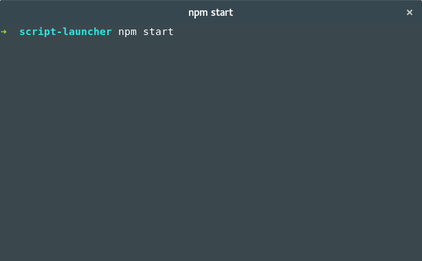

[](https://www.npmjs.com/package/script-launcher)
[](#)
[](https://www.npmjs.com/package/script-launcher)
[](https://david-dm.org/chanzo/script-launcher) 
[](https://david-dm.org/chanzo/script-launcher?type=dev) 
[](/LICENSE) 

[](https://github.com/chanzo/script-launcher/fork)
[](https://github.com/chanzo/script-launcher) 

# Script Launcher

Enhance your **package.json** scripts with features like: menus, functions, arrays, concurrency and many more. The features of Script Launcher are specialized in such a way, that working with Mac, Linux and Windows can be seamless experience. 



# Table of Contents
* [Installation](#installation)
* [Usage examples](#usage-examples)
* [Migrate package.json scripts](#migrate-packagejson-scripts)
* [Motivation](#motivation)
* [Implementation examples](#implementation-examples)
  * [Sequential scripts](#sequential-scripts)
  * [Change directory](#change-directory)
  * [Parameters and functions](#parameters-and-functions)
  * [Reference scripts](#reference-scripts)
  * [Reference scripts by using wildcards](#reference-scripts-by-using-wildcards)
  * [Environment and command line argument values](#environment-and-command-line-argument-values)
  * [Launch arguments, command arguments, parameters and arguments](#launch-arguments-command-arguments-parameters-and-arguments)
  * [Escaping characters](#escaping-characters)
  * [Environment values and special commands](#environment-values-and-special-commands)
  * [Glob patterns](#glob-patterns)
  * [Concurrent scripts](#concurrent-scripts)
  * [Inline script blocks](#inline-script-blocks)
  * [Confirmation prompt](#confirmation-prompt)
  * [Condition and exclusion constraints](#condition-and-exclusion-constraints)
  * [Repeaters (String)](#repeaters-string)
  * [Repeaters (Object)](#repeaters-object)
  * [Interactive menu](#interactive-menu)
* [Launcher arguments](#launcher-arguments)
  * [Launcher Command: init](#launcher-command-init)
  * [Launcher Command: migrate](#launcher-command-migrate)
  * [Launcher Command: script](#launcher-command-script)
* [Launcher settings](#launcher-settings)
* [Launcher options](#launcher-options)
  * [Launcher files](#launcher-files)
  * [Script shell](#script-shell)
  * [Glob Options](#glob-options)
  * [Menu options](#menu-options)
  * [Logging](#logging)

## Installation

Install **script-launcher** as a development dependency in your project.
``` bash
npm install script-launcher --save-dev
```

Use **launch init** to create a starter configuration based on one of the available templates.

``` bash
npx launch init basic
```

If not already done so, change your **package.json** start script, so it will start Script Launcher. If you do not want to change your start script, you can also add [custom run scripts](#start-a-specific-launch-script,-by-using-the-npm-run) for starting Script Launcher.

Example: **package.json**
``` JSON
{
    ...
    "scripts": {
        "start": "launch",
        ...
    },
    ...
}
```
You are now ready to start use Script Launcher by running: `npm start` or `npm run serve:dev`.

## Usage examples

### Show menu
``` bash
npm start
```
You can also show the menu by running: `npx launch`

### Start a specific launch script, by using the `npm start`
``` bash
npm start serve:dev
npm start build:production
```
Basically you can now use `npm start` instead of `npm run`.

### Start a specific launch script, by using the `npm run`
For a cusom run script to work, you have to add a script to your **package.json** file, make sure there is a similar named script in your **launcher-config.json** file.

Example: **package.json**
``` JSON
{
    ...
    "scripts": {
        "serve:dev": "launch",
        "build:production": "launch"
        ...
    },
    ...
}
```

Example run commands
``` bash
npm run serve:dev
npm run build:production
```

## Migrate package.json scripts
Make sure all your repository changes are fully committed so you can undo the changes easily if they do not suit your needs. Remove or rename the start script in your **package.json** file.

Now your are ready to migrate your **package.json** scripts to **launcher-config.json** scripts. By executing the command:
``` bash
npx launch migrate
```

Migrate using parameter migration option:
``` bash
npx launch migrate --params
```

## Motivation

In a traditional **package.json** you can only run scripts on a per line basis. With larger projects that have multiple environments, this can quickly become a hassle and difficult to maintain, like the example below:

``` JSON
// Traditional package.json scripts //
{
  "scripts": {
    "build:uva:dev": "ng build uva -c=dev --prod",
    "build:uva:tst": "ng build uva -c=tst --prod",
    "build:uva:acc": "ng build uva -c=acc --prod",
    "build:uva:prd": "ng build uva -c=prd --prod",
    "build:hva:dev": "ng build hva -c=dev --prod",
    "build:hva:tst": "ng build hva -c=tst --prod",
    "build:hva:acc": "ng build hva -c=acc --prod",
    "build:hva:prd": "ng build hva -c=prd --prod",
    "deploy:uva:dev": "npm run build:uva:dev && firebase deploy --public dist/uva --project status-uva-dev",
    "deploy:uva:tst": "npm run build:uva:tst && firebase deploy --public dist/uva --project status-uva-tst",
    "deploy:uva:acc": "npm run build:uva:acc && firebase deploy --public dist/uva --project status-uva-acc",
    "deploy:uva:prd": "npm run build:uva:prd && firebase deploy --public dist/uva --project status-uva-prd",
    "deploy:hva:dev": "npm run build:hva:dev && firebase deploy --public dist/hva --project status-hva-dev",
    "deploy:hva:tst": "npm run build:hva:tst && firebase deploy --public dist/hva --project status-hva-tst",
    "deploy:hva:acc": "npm run build:hva:acc && firebase deploy --public dist/hva --project status-hva-acc",
    "deploy:hva:prd": "npm run build:hva:prd && firebase deploy --public dist/hva --project status-hva-prd",
    "deploy:dev": "npm run deploy:uva:dev && npm run deploy:hva:dev",
    "deploy:tst": "npm run deploy:uva:tst && npm run deploy:hva:tst",
    "deploy:acc": "npm run deploy:uva:acc && npm run deploy:hva:acc",
    "deploy:prd": "npm run deploy:uva:prd && npm run deploy:hva:prd"
  }        
}
```

With **script-launcher** you have the benefits of using variables, script references and many more features, so you can make the above example easier to maintain:
``` JSON
// Example when using Script Launcher //
{
  "scripts": {
    "build:$project:$config": "ng build $project -c=$config --prod",
    "deploy:$project:$config": [
      "build:$project:$config",
      "firebase deploy --public dist/$project --project status-$project-$config"
    ],
    "deploy:$config": [
      "deploy:uva:$config",
      "deploy:hva:$config"
    ]
  }
}
```
To start this example you would use: `npm start build:uva:tst`, `npm start deploy:prd` etc.

It's also possible to extend the example with an interactive menu, so a new developer can get start on your project more easily:
``` JSON
{
  "menu": {
    "description": "deploy organization",
    "uva:University of Amsterdam.": {
      "description": "deploy environment",
      "acceptance": "deploy:uva:acc",
      "production": "deploy:uva:tst"
    },
    "hva:Amsterdam University of Applied Sciences.": {
      "description": "deploy environment",
      "acceptance": "deploy:hva:acc",
      "production": "deploy:hva:tst"
    }
  },
  "options": {
    "menu": {
      "defaultChoice": "hva:acc"
    }
  }
}
```

You would use: `npm start` to start the menu.

## Implementation examples
To test an example, copy the json content from the example to the file named **launcher-config.json** and run the script.

### Sequential scripts
This example uses square brackets to start multiple script one by one. This feature will make long script lines more readable.

**Run**: `npm start build-stuff` to use this example.
``` JSON
{
  "scripts": {
    "build-stuff": [
      "echo Build step 1",
      "echo Build step 2",
      "echo Build step 3"
    ]
  }
}
```

### Change directory
Specify an existing directory as an script command and it will change to that directory for the next scripts it executes. This can be handy if your script have to be run from within a different location.

**Run**: `npm start build-stuff` to use this example.
``` JSON
{
  "scripts": {
    "build-stuff": [
      "node_modules/script-launcher",
      "echo *.js"
    ]
  }
}
```

### Parameters and functions
Use the dollar-sign in the script id and command, to specify script function parameter. You can specify a default value by using the equal sign. This feature makes it possible to start one script with different parameters.

**Run**: `npm start serve` , `npm start serve::tst` or `npm start serve:hva:prd` etc, to use this example.
``` JSON
{
  "scripts": {
    "serve:$project=uva:$config=dev": "echo ng serve $project -c=$config"
  }
}
```

### Reference scripts
Use an existing script id in the command section to execute another script in your config file. This feature makes it possible to reuse scripts from another script, with different arguments if desired.

**Run**: `npm start deploy:tst` to use this example.
``` JSON
{
  "scripts": {
    "build:$project:$config": "echo ng build $project -c=$config",
    "deploy:$project:$config": [
      "build:$project:$config",
      "echo firebase deploy --public dist/$project -P $project-$config"
    ],
    "deploy:$config": [
      "deploy:uva:$config",
      "deploy:hva:$config"
    ]
  }
}
```

### Reference scripts by using wildcards
Use wildcards '*' to select multiple scripts. Wildcards cannot be used for selecting function by there parameters, this will result in a parameter containing the wildcard..

**Run**: `npm start build:*` , `npm start build:all` or `npx launch --concurrent build:*` to use this example.
``` JSON
{
  "scripts": {
    "build:css": "echo Building: .css files",
    "build:js": "echo Building: .js files",
    "build:html": "echo Building: .html files",
    "build:all": {
      "concurrent": [
        "build:*"
      ]
    }
  }
}
```


### Environment and command line argument values
Use the dollar-sign in the script command, to references command line arguments and environment variables on Linux, Mac and windows in a consistent manner. It is also possible to set environment variables and use aliases. 

For compatibility reasons: when using a script id that is equal to the command being executed, all arguments are appended automatically.

**Run**: `npm start build-stuff arg1 arg2 arg3` or `npm start echo arg1 arg2 arg3` to use this example.
``` JSON
{
  "scripts": {
    "build-stuff": [
      "environment=my-env",
      "node=$npm_config_node",
      "echo Node version: $node_version",
      "echo Node version: $npm_config_node_version",
      "echo Argument 1 : $1",
      "echo Argument 2 : $2",
      "echo",
      "echo All arguments: $*",
      "echo Offset arguments: $2*",
      "echo Environment : $environment"
    ],
    "echo": "echo"
  }
}
```
In this example **node** will be an alias for **$npm_config_node**. So **$node_version** corresponds to **$npm_config_node_version**

### Launch arguments, command arguments, parameters and arguments
* **Launch arguments:** These are values passed to `laucher` directly, for example: `launch init` or `launch version`
* **Command arguments:** These are values passed from the command line that was used to start the script, for example: `npm start build my-arg1 my-arg2`
* **Function arguments:** These are values passed from scripts to a function. Arguments are accessed by a number, for example: `$1`
* **Parameters:** These are for passing a fixed set of values to a function. Parameters are accessed by their name, for example: `$project`

**Run**: `npm start build-stuff:param1:param2 arg1 arg2 arg3` to use this example.

``` JSON
{
  "scripts": {
    "myFunc:$funcParam1:$funcParam2": [
      "echo Function Parameter 1: $funcParam1",
      "echo Function Parameter 2: $funcParam2",
      "echo Function Arguments 1: $1",
      "echo Function Arguments 2: $2",
      "echo Function All arguments: $*"
    ],
    "build-stuff:$myParam1:$myParam2": [
      "--",
      "echo Main Parameter 1: $myParam1",
      "echo Main Parameter 2: ${myParam2}",
      "echo Main Arguments 1: $1",
      "echo Main Arguments 2: $2",
      "echo Main All arguments: $*",
      "echo Main Offset arguments: $2*",
      "--",
      "myFunc:$myParam1:funcParam funcArg $1",
      "--"
    ]
  }
}
```

### Escaping characters
Use a backslash in the script command, to escaping variables.

**Run**: `npm start escaping arg1` to use this example.
``` JSON
{
  "scripts": {
    "escaping": [
      "echo '\\$1                        ' : '$1'",
      "echo '\\$npm_config_node_version  ' : '$npm_config_node_version'",
      "echo '\\${1}                      ' : '${1}'",
      "echo '\\${npm_config_node_version}' : '${npm_config_node_version}'"
    ]
  }
}
```

### Environment values and special commands
| Pattern                 | Type        | Description                                           |
| ----------------------- | ----------- | ----------------------------------------------------- |
| **launch_version**      | Environment | Launcher Version number                               |
| **launch_platform**     | Environment | Operating system **[platform](https://nodejs.org/api/process.html#process_process_platform)**|
| **launch_time_start**   | Environment | Start time                                            |
| **launch_time_current** | Environment | Current time                                          |
| **launch_time_elapsed** | Environment | Elapsed time                                          |
| **launch_style_blue**   | Environment | <span style="color:#0000FF">**Blue text**</span>      |
| **launch_style_bold**   | Environment | **Bold text**                                         |
| **launch_style_cyan**   | Environment | <span style="color:#00FFFF">**Cyan text**</span>      |
| **launch_style_dim**    | Environment | <span style="color:#707070">**Dim text**</span>       |
| **launch_style_green**  | Environment | <span style="color:#00FF00">**Green text**</span>     |
| **launch_style_normal** | Environment | Nomal text                                            |
| **launch_style_red**    | Environment | <span style="color:#FF0000">**Red text**</span>       |
| **launch_style_yellow** | Environment | <span style="color:#FFFF00">**Yellow text**</span>    |
| **"echo"**              | Command     | Output an empty line                                  |
| **""**                  | Command     | Output an empty line                                  |
| **"--"**                | Command     | Line with the width of the terminal                   |
| **" \|\| true"**        | Command     | Added at the end of a command to suppress errors      |
| **"#"**                 | Command     | Added at the begining for a line to disable execution |
| **"\|?"**               | Command     | Grep like functionality                               |

**Run**: `npm start build-stuff` to use this example.
``` JSON
{
  "scripts": {
    "build-stuff": {
      "condition": "echo grep example |? example",
      "sequential-then": [
        "echo ${launch_style_bold}Version:$launch_style_normal $launch_version",
        "echo ${launch_style_bold}Platform:$launch_style_normal $launch_platform",
        "echo ${launch_style_bold}Time:$launch_style_normal $launch_time_start",
        "--",
        "echo Color: ${launch_style_blue}Blue$launch_style_normal",
        "echo Color: ${launch_style_bold}Bold$launch_style_normal",
        "echo",
        "echo Color: ${launch_style_cyan}Cyan$launch_style_normal",
        "echo Color: ${launch_style_dim}Dim$launch_style_normal",
        "",
        "# The error of the next action will be suppressed",
        "exit 1 || true",
        "echo Color: ${launch_style_green}Green$launch_style_normal",
        "echo Color: ${launch_style_red}Red$launch_style_normal",
        "echo Color: ${launch_style_yellow}Yellow$launch_style_normal",
        "--",
        "echo ${launch_style_bold}Current:$launch_style_normal $launch_time_current",
        "echo ${launch_style_bold}Elapsed:$launch_style_normal $launch_time_elapsed"
      ]
    }
  }
}
```

### Glob patterns
Script Launcher makes use of the [Glob](https://www.npmjs.com/package/glob) package, so you can use any of the supported glob patterns in your scripts.

**Run**: `npm start build-stuff` to use this example.
``` JSON
{
  "scripts": {
    "build-stuff": [
      "node_modules/script-launcher",
      "echo Javascript files files: *.js",
      "echo Markdown files: **/*.md"
    ]
  }
}
```

### Concurrent scripts
This example uses the **concurrent** keyword to run multiple script in parallel and the **sequential** keyword to start multiple script one by one. This feature is convenient in a development environment, when you want to start development server in the background.

**Run**: `npm start build-stuff` to use this example.
``` JSON
{
  "scripts": {
    "sleep:$time": "node -e \"setTimeout(() => {}, $time)\"",
    "background:$job:$time": [
      "echo Background job : $job",
      "sleep:$time",
      "echo Completed job : $job"
    ],
    "build-stuff": {
      "concurrent": [
        "background:1:3000",
        "background:2:5000"
      ],
      "sequential": [
        "echo Sequential job : 3",
        "sleep:1000",
        "echo Sequential job : 4",
        "sleep:1000"
      ]
    }
  }
}
```

### Inline script blocks
This example uses the inline script blocks to run multiple script in parallel and to run multiple script one by one.

**Run**: `npm start build-stuff` to use this example.
``` JSON
{
  "scripts": {
    "sleep:$time": "node -e \"setTimeout(() => {}, $time)\"",
    "background:$job:$time": [
      "echo Background job : $job",
      "sleep:$time",
      "echo Completed job : $job"
    ],
    "build-stuff": [
      [
        "background:1:3000",
        "background:2:5000"
      ],
      {
        "sequential": [
          "echo Sequential job : 3",
          "sleep:1000",
          "echo Sequential job : 4",
          "sleep:1000"
        ]
      }
    ]
  }
}
```

### Confirmation prompt
Confirmation prompts can be used for asking a confirmation to continue. Use the **confirm** argument to auto confirm.

**Run**: `npm start build-stuff` to use this example.
``` JSON
{
  "scripts": {
    "build-stuff": {
      "confirm": "Are you sure you want to continue",
      "sequential-then": "echo You are sure!",
      "sequential-else": "echo You are not sure!"
    }
  }
}
```

### Condition and exclusion constraints
* **condition:** Must evaluate to true or 0 for the corresponding script block to be executed.
* **exclusion:** Must evaluate to false or !0 for the corresponding script block to be executed.

The value of the **condition** and **exclusion** statement can be a string or an array of strings containing a JavaScript expression returning a Boolean, directory name or a shell command.

**Run**: `npm start build-stuff` to use this example.
``` JSON
{
 "scripts": {
    "build-stuff": [
      {
        "exclusion": "node_modules_test",
        "sequential-then": [
          "echo npm install",
          "mkdir node_modules_test"
        ]
      },
      {
        "condition": "node_modules_test",
        "sequential-then": [
          "echo npm start",
          {
            "condition": "'$launch_platform'==='win32'",
            "sequential": "echo Test platform type.",
            "sequential-then": "rmdir node_modules_test",
            "sequential-else": "rm -d node_modules_test"
          }
        ]
      }
    ]
  },
  "options": {
    "logLevel": 2
  }
}
```

### Repeaters (String)
The **repeater** statement must contain a reference to a settings array. The corresponding script block will be executed for each instance in the settings array.

Example using a string array.
**Run**: `npm start ping` to use this example.
``` JSON
{
  "scripts": {
    "ping": [
      {
        "repeater": "$launch_setting_servers",
        "sequential": [
          "echo Action: $launch_setting_command $_"
        ]
      }
    ]
  },
  "settings": {
    "command": "ping",
    "servers": [
      "www.google.com",
      "duckduckgo.com",
      "bing.com"
    ]
  }
}
```

### Repeaters (Object)
Example using an object array. 
**Run**: `npm start ping` to use this example.
``` JSON
{
  "scripts": {
    "ping": [
      {
        "repeater": "$launch_setting_servers",
        "sequential": [
          "echo $_name",
          "--",
          "echo Action: $launch_setting_command $_host",
          ""
        ]
      }
    ]
  },
  "settings": {
    "command": "ping",
    "servers": [
      {
        "name": "Google",
        "host": "www.google.com"
      },
      {
        "name": "DuckDuckGo",
        "host": "duckduckgo.com"
      },
      {
        "name": "Bing",
        "host": "bing.com"
      }
    ]
  }
}
```

### Interactive menu
Use the **menu** section to create an interactive landing menu, so a new developer can get start on your project more easily. 

* **description** keyword is used as a description of presented values.

Use `npm start` to show the menu, after selecting your desired action you will have the option to save your selection. If you choose to do so, your selection will be saved in the `launcher-custom.json` file. Use `npm start menu` to ignore the `defaultScript` option, in the `launcher-custom.json` file, so the menu will be interactive. 

The **options.menu.timeout** can be used to auto close the menu after a specified time. Use the [Menu options](#menu-options) section for more information on all the available options.

**Run**: `npm start` to use this example.
``` JSON
{
  "scripts": {
    "serve:$project:dev": {
      "concurrent": [
        "echo Start development server",
        "echo ng serve $project -c=dev"
      ]
    },
    "serve:$project:$config": "echo ng serve $project -c=$config"
  },
  "menu": {
    "description": "organization",
    "uva:University of Amsterdam.": {
      "description": "environment",
      "development": "serve:uva:dev",
      "acceptance": "serve:uva:acc",
      "production": "serve:uva:prd"
    },
    "hva:Amsterdam University of Applied Sciences.": {
      "description": "environment",
      "development:Builds and serves your app for development.": "serve:hva:dev",
      "acceptance:Builds and serves your app for acceptance.": "serve:hva:acc",
      "production:Builds and serves your app for production.": "serve:hva:prd"
    }
  },
  "options": {
    "menu": {
      "defaultChoice": "hva:development"
    }
  }
}
```

## Launcher arguments
Use the **help** for a list of available options.

**Run**: `npx launch --help` this will list the available options
``` bash
Usage: launch [command] [options...]

Commands:
  init         [template] Create starter config files.
  list         List available launcher script.
  migrate      Migrate your package.json scripts.
  help         Show this help.
  version      Outputs launcher version.

Options:
  logLevel=    Set log level.
  config=      Merge in an extra config file.
  confirm=     Auto value for confirm conditions.
  ansi=        Enable or disable ansi color output.
  directory=   The directory from which configuration files are loaded.
  menuTimeout= Set menu timeout in seconds.
  params=      Set the number of parameters to preserve.
  concurrent=  Execute commandline wildcard matches in parallel.
```

### Launcher Command: init
Use the **init** command to create a starter configuration for you project.

**Run**: `npx launch init` this will list the available templates
``` bash
Available templates:

angular
basic
blank

Example usage: npx launch init basic
```

**Run**: `npx launch init basic` this will create a basic starter configuration
``` bash
Create starter config: basic

Createing: launcher-config.json
Createing: launcher-menu.json

Updating package.json.

Start script of package.json updated.
```

### Launcher Command: migrate
Use the **migrate** command to convert your **package.json** script to a script-launcher configuration. Use the **params** option the parameterize your script functions.

**Run**: `npx launch migrate --params=1` this will convert your **package.json** scripts
``` bash
Migrating: package.json

Script to migrate: 12
Script to update: 2

✔ Are you sure … yes

Updating: package.json
Creating: launcher-menu.json
Creating: launcher-config.json
```

### Launcher Command: script
Start one or more script directly from the command line sequentially or concurrently

**Run**: `npx launch build:css build:js` to start one or more script in sequence
``` bash
Building: .css files
Building: .js files
```

**Run**: `npx launch build:css build:js --concurrent` to start one ore more script in parallel
``` bash
Building: .css files
Building: .js files
```


## Launcher settings
The launcher settings can be used to specify named values that can be used by the launcher scripts. Consult the [repeaters](#repeaters) implementation examples section for more information on repeaters.

**Run**: `npm start build:dev` , `npm start build:acc` or `npm start build:production` to use this example.
``` JSON
{
  "scripts": {
    "build:$config": [
      "settings=$launch_setting_${config}",
      "echo name: $launch_setting_name",
      "echo version: $settings_version",
      "echo ng build -c=$config --deploy-url $settings_url",
      "",
      {
        "repeater": "$launch_setting_${config}_server",
        "sequential": [
          "echo Deploying to: $_"
        ]
      }
    ]
  },
  "settings": {
    "name": "example",
    "dev": {
      "version": "2.0.0",
      "url": "$launch_setting_name.dev.com",
      "server": [
        "server1.dev.com",
        "server2.dev.com"
      ]
    },
    "acc": {
      "version": "1.9.0",
      "url": "$launch_setting_name.acc.com",
      "server": [
        "server1.acc.com",
        "server2.acc.com"
      ]
    },
    "production": {
      "version": "1.8.0",
      "url": "$launch_setting_name.prd.com",
      "server": [
        "server1.prd.com",
        "server2.prd.com"
      ]
    }
  }
}
```

## Launcher options
The launcher **options** can be used the customize the default behavior of Script Launcher.

### Launcher files
The **files** options can be used to configure the config files to load when starting launcher. When using multiple files they will be merged together in the loading order. Be aware the `launcher-config.json` is always the first file being loaded even when it is not present in the files list.

By using this option it's possible the split your configuration over multiple files. It's a good practice is to split your script and menu configurations to their own file. You could also include the `package.json` file in this list, then you can use the strength of Script Launcher in your `package.json` file.

The default value of this list is presented in the following example:
``` JSON
{
  "scripts": {
    ...
  },
  "options": {
    "files": [
      "launcher-config.json",
      "launcher-scripts.json",
      "launcher-settings.json",
      "launcher-menu.json",
      "launcher-custom.json",
    ]
  }
}
```

### Script shell
The **script shell** options can be used to configure the spawn shell, this value is passed to the [options shell](https://nodejs.org/api/child_process.html#child_process_child_process_spawn_command_args_options) of the node **child_process.spawn** method. If you want to specify a shell for a specific platform, use one of the [platform names](https://nodejs.org/api/process.html#process_process_platform) as a nested object name. If there is no platform name match found the default will be used.

Example shell option for specific platform
``` JSON
{
  "scripts": {
    ...
  },
  "options": {
    "script": {
      "shell": {
        "aix":"bash",
        "darwin":"bash",
        "freebsd":"bash",
        "linux":"bash",
        "openbsd":"bash",
        "sunos":"bash",
        "win32":"cmd.exe",
        "default":"bash"
      }
    }
  }
}
```

The default value is presented in the following example:
``` JSON
{
  "scripts": {
    ...
  },
  "options": {
    "script": {
      "shell": true
    }
  }
}
```

### Glob Options
[Official documentation of the `fast-glob` options](https://www.npmjs.com/package/fast-glob#options-3)
If the *nonull* script-launcher option is set, and no match was found, then the match contains the original pattern.
``` JSON
{
  "options": {
    "glob": {
      "nonull": false
    }
  }
}
```

### Menu options
* **defaultChoice:** Specify the default selected entries of your menu separated by a colon. 
* **menu defaultScript:** Auto start a specific script, this will disable the interactive menu. 
* **timeout:** Auto close/select a menu value after a specified time.

The default value is presented in the following example:
``` JSON
{
  "scripts": {
    ...
  },
  "options": {
    "menu": {
      "defaultChoice": "",
      "defaultScript": "",
      "timeout": 0
    }
  }
}
```

### Logging
The **logLevel** option is used for configuring the Script Launcher log level, available values are: 0=disabled  1=info  2=log  2=debug

The default value is presented in the following example:
``` JSON
{
  "scripts": {
    ...
  },
  "options": {
    "logLevel": 0
  }
}
```
